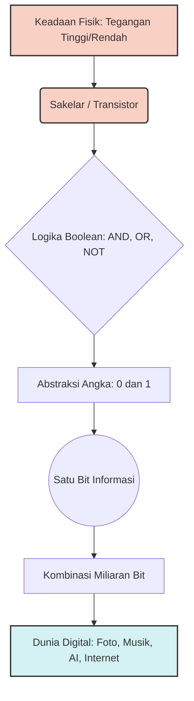

Pernah nggak sih, lagi duduk santai di warung kopi sambil menyeruput kopi hangat, terus tiba-tiba kepikiran satu pertanyaan aneh: *kenapa sih komputer cuma paham angka 0 dan 1?* 

Kita sebagai manusia terbiasa dengan 10 angka, dari 0 sampai 9. Rasanya sangat natural. Padahal, nggak ada hukum alam yang mewajibkan kita menghitung pakai basis 10. Kita bisa saja pakai basis 8 atau basis 12. Komputer juga sebenarnya bebas memilih. Tapi nyatanya, hampir seluruh dunia komputer modern dibangun hanya dari dua simbol: **0 dan 1**.

Kenapa nggak ditambah angka 2 saja? Kalau tiga keadaan bisa membawa lebih banyak informasi, bukankah komputer basis 3 seharusnya lebih efisien? 

Jawabannya ternyata nggak dimulai dari ruang kelas matematika, melainkan dari dunia nyata yang berdebu dan penuh kabel, yaitu dari sebuah **sakelar**.

---

### Komputer Nggak Benar-benar "Melihat" Angka

Ketika kita melihat kode `10110101`, kita sering membayangkan ada makhluk kecil di dalam komputer yang sedang membaca angka-angka itu. Padahal nggak begitu. 

Di tingkat paling dasar, komputer sama sekali nggak kenal angka. Ia hanya mengenal **keadaan fisik**. Ada tegangan listrik, ada arus, ada muatan, dan ada komponen yang bisa berada dalam kondisi tertentu. 

Komponen paling penting di sini adalah transistor. Bayangkan transistor sebagai sakelar elektronik super kecil yang mengontrol apakah arus listrik mengalir atau tidak. Dari sini, kita bisa memetakan dua keadaan fisik tersebut menjadi:
* Mati menjadi 0
* Nyala menjadi 1

Inilah trik sederhana yang menjadi fondasi seluruh komputer digital. Begitu kita punya dua keadaan yang bisa dibedakan dengan andal, kita sudah punya sesuatu yang sangat berharga, yaitu **bit**.

---

### Matematika Bilang "Bisa", Fisika dan Engineering Bilang "Waduh"

Di sinilah letak perbedaan mencolok antara teori matematika dan realita fisika dalam engineering.

**Menurut Teori Matematika:**
Sistem basis 3 (ternary) sebenarnya ide yang sangat menarik. Satu digit ternary punya 3 kemungkinan (0, 1, 2), sedangkan satu digit biner cuma punya 2 kemungkinan (0, 1). Secara teori informasi, semakin banyak keadaan, semakin banyak data yang bisa dibawa per elemen. Jadi, secara matematis, basis 3 itu lebih efisien.

**Menurut Realita Fisika dan Engineering:**
Di atas kertas, membagi tegangan menjadi tiga level terlihat mudah. Misalnya:
* 0 volt untuk angka 0
* 2,5 volt untuk angka 1
* 5 volt untuk angka 2

Tapi elektronika nggak hidup di atas kertas. Di dunia nyata, ada panas, ada gangguan listrik (noise), ada perubahan tegangan yang tidak stabil, dan ada variasi kecil saat komponen diproduksi di pabrik. 

Apa yang terjadi kalau sinyal yang seharusnya 2,5 volt bergeser jadi 2,3 volt? Mungkin masih bisa dibaca sebagai 1. Tapi bagaimana kalau turun jadi 1,2 volt? Di sinilah sistem mulai panik. Rangkaian harus bekerja sangat keras untuk menebak: "Ini sebenarnya 0 atau 1 ya?"

Semakin banyak keadaan yang kita paksakan ke dalam rentang fisik yang sama, semakin sempit jarak antar keadaan tersebut. Semakin sempit jaraknya, semakin mudah sistem terkena error karena noise. 

Dengan hanya menggunakan dua keadaan (0 dan 1), engineer bisa memberikan "zona aman" yang sangat luas. Kita cukup bilang, "Selama tegangan ada di wilayah bawah, anggap saja 0. Selama di wilayah atas, anggap saja 1." Sisa ruang di tengahnya menjadi penyangga yang aman dari gangguan. Inilah alasan besar kenapa dua keadaan adalah kompromi engineering yang jenius.

---

### Alur Abstraksi: Dari Fisika ke Dunia Digital

Agar lebih mudah dibayangkan, berikut adalah alur bagaimana keadaan fisik yang sederhana berubah menjadi informasi digital yang kompleks:

---

### Dari Sakelar Mekanis Menuju Otak Buatan

Jauh sebelum transistor memenuhi prosesor modern, para insinyur sudah bermain dengan sakelar berukuran besar bernama relay. Relay bisa membuka atau menutup rangkaian. Perilaku sederhana ini ternyata sangat mirip dengan logika manusia. 

Jika dua sakelar harus aktif agar lampu menyala, itu adalah logika **AND**. Jika salah satu saja aktif lampu sudah menyala, itu adalah logika **OR**. Jika kita ingin membalik keadaan, itu adalah logika **NOT**.

Pada akhir tahun 1930-an, Claude Shannon punya ide brilian. Ia menunjukkan bahwa rangkaian sakelar ini bisa dianalisis menggunakan aljabar Boolean. Ia menghubungkan dunia sakelar fisik dengan dunia matematika logika. Sejak saat itu, sakelar bukan lagi sekadar pemutus arus, melainkan menjadi gerbang logika. 

Dari gerbang AND, OR, dan NOT yang disusun secara masif, kita bisa membangun penjumlah, memori, pengendali, hingga unit pemrosesan pusat. Masalahnya, relay itu besar dan lambat. 

Lalu pada tahun 1947, transistor ditemukan di Bell Labs. Transistor melakukan pekerjaan yang sama persis dengan relay, tapi ukurannya super kecil dan nggak punya bagian mekanis yang bergerak. Dari sinilah, vakum tabung digantikan transistor, transistor dipadatkan menjadi sirkuit terpadu, dan berkembang menjadi mikroprosesor yang kita pakai sekarang. Konsep dasarnya tetap sama: sakelar, 0, dan 1.

---

### Jadi, Bisakah Kita Membuat Komputer Ternary?

Jawabannya: **Bisa banget.** 

Komputer ternary bukan hal mustahil. Kita secara teknis bisa membangun rangkaian dengan lebih dari dua level logika. Tapi, kenapa kita tidak melakukannya? 

Kembali lagi ke perseteruan antara teori dan praktik. Di dunia nyata, ada biaya implementasi yang membengkak, ada masalah noise yang makin rumit, ada konsumsi daya, dan ada kompleksitas desain yang luar biasa. 

Yang paling penting, seluruh ekosistem industri komputer global sudah dibangun di atas fondasi binary selama puluhan tahun. Mengganti fondasi ini membutuhkan keuntungan yang luar biasa besar, yang sayangnya tidak bisa ditutupi oleh keunggulan teoritis basis 3. 

Binary menang bukan karena angka 2 adalah angka paling ajaib di alam semesta. Binary menang karena dua keadaan adalah **kompromi engineering terbaik**: cukup sederhana untuk dibuat, cukup mudah dibedakan, cukup tahan terhadap noise, dan cukup kuat untuk membangun logika yang sangat kompleks.

---

### Kekuatan yang Lahir dari Komposisi

Satu bit dengan dua pilihan memang terlihat sangat sedikit. Tapi keajaiban terjadi saat kita menggabungkannya. 

Satu bit memberi 2 kemungkinan. Dua bit memberi 4 kemungkinan. Delapan bit memberi 256 kemungkinan. Tiga puluh dua bit memberi lebih dari empat miliar kemungkinan. 

Ketika sebuah chip modern memiliki miliaran transistor yang bekerja bersamaan, jumlah kombinasi keadaannya menjadi astronomis. Kekuatan binary nggak berasal dari satu digit yang keren, melainkan dari **komposisi** miliaran sakelar sederhana yang saling berinteraksi. 

Dari situlah, foto, musik, video, pesan WhatsApp, game, hingga kecerdasan buatan yang sedang kita bicarakan ini, semuanya lahir. Semuanya hanyalah pola yang sangat panjang dari keadaan diskrit.

---

### Penutup

Jadi, kenapa komputer memakai basis 2? 

Bukan karena komputer nggak bisa menghitung dengan cara lain. Bukan karena basis 10 itu buruk. Melainkan karena perangkat kerasnya sangat cocok dengan dua keadaan yang bisa dibedakan dengan jelas dan aman. 

Ketika kita punya sakelar dengan dua kondisi, kita dapat cara sederhana untuk merepresentasikan logika. Ketika kita gabungkan banyak sakelar, kita dapat rangkaian. Ketika kita gabungkan banyak rangkaian, kita dapat komputer. Dan ketika kita hubungkan banyak komputer, kita mendapatkan dunia digital yang luar biasa ini.

Pada akhirnya, seluruh revolusi digital yang canggih ini dibangun dari sebuah ide yang sangat sederhana. Cukup dengan membedakan dua keadaan: nyala atau mati, ada atau tidak ada, ya atau tidak, **0 atau 1**.

Mungkin itulah bagian paling menakjubkan dari komputer. Di balik semua kompleksitasnya yang mampu menerbangkan pesawat atau mensimulasikan alam semesta, pada level paling dasar, ia masih sangat mirip dengan sebuah pertanyaan sederhana yang diajukan kepada sebuah sakelar kecil:

**"Kamu lagi nyala, atau mati?"**